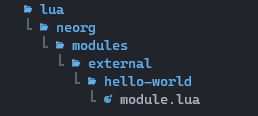

This series of tutorials will help you better understand how to create
custom modules for Neorg.

# Create a local plugin

Before starting to work on the module, let's take a look at how to create a
local neovim plugin and at the folder structure that we'll need to make this module
work within Neorg.

First of all, create a folder for your project. In my case, it will be
`~/projects/my-neorg-module`.

# Choosing a name

Once we've created the plugin folder, we have to choose a name for our module.
We have to do it now because it will have an impact on the naming of our 
folders.

A module name looks something like this: `category.module.submodule`.

When naming our modules, let's keep in mind these conventions:

- Core modules (only for the modules that come with Neorg): `core.*`

- Integrations with 3rd party software that are embedded in neorg: `core.integrations.*`

- External modules: `external.*`

- Integrations with 3rd party software that aren't embedded in neorg: `external.integrations.*`
  
  For example, if we want to create a module that integrates a service like GPT-3 
  within neorg, we could name it: `external.integrations.gpt3`.
  
  In our example, we will call it `external.hello-world`.

# Folder structure

Inside the plugin root, we will have the usual `lua` folder.
Inside this folder, we need to create a basic structure, that is always the same for
all Neorg modules:
`neorg` → `modules`.

Inside the `modules` folder, we'll need to create the folders nested as our new module
name would suggest. That means, we'll need to create an `external` folder with a `hello-world` folder inside.
Here is a picture of our final plugin structure:



The `module.lua` file is where the logic and api for our modules will be located.

# A basic `module.lua`

For our first module, we're going to do the usual "Hello World!" exercise, and create 
a module that will print the message when loaded.

To create a new module, we need to require `neorg.modules.base` and use the Neorg api to create a new module:

```lua
require('neorg.modules.base')

local module = neorg.modules.create('external.hello-world')
```

Now, we can create the `module.load` function to execute some code when this module is loaded during Neorg startup:

```lua
module.load = function ()
    print("Hello world!")
end
```

In the end, we need to return the module. The complete code looks like this:

```lua
require('neorg.modules.base')

local module = neorg.modules.create('external.hello-world')

module.load = function ()
  print('Hello world!')
end

return module
```

# Adding it to Neorg

With our first module ready, we can add it to our Neorg configuration.

For [Lazy.nvim](https://github.com/folke/lazy.nvim) it will look something like this (only relevant lines included):

```lua
  {
    'nvim-neorg/neorg',

    opts = {
      -- Add your new module to Neorg configs
      load = {
        ['external.hello-world'] = {}
      }
    },

    -- Add the plugin folder as a dependency (or the git location when deployed)
    dependencies = {
      { dir = '~/projects/my-neorg-module' },
    }
  }
```

For [Packer.nvim](https://github.com/wbthomason/packer.nvim) it is pretty similar:

```lua
use {
  'nvim-neorg/neorg',

  config = function()
    require('neorg').setup {
      load = {
        ['external.hello-world'] = {}
      }
    }
  end,

  requires = {
    '~/projects/my-neorg-module'
  }
}
```

# Result

With the module added to the configuration, we should see a "Hello world!" message when we open neovim.
Of course, this is not very useful. To make a useful module, we're going to need a way to interact with the user.

We're going to see how to do that in our next tutorial.
