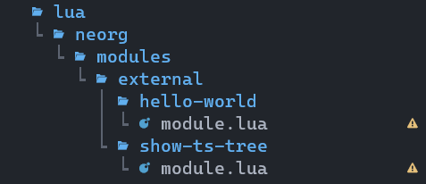

# How to create custom Neorg modules - part 3

In part 2 of this tutorial, we've seen some of the options we can use in our module, now let's apply them in practice. 

We'll create a new module that will print the treesitter tree for the node we're currently on with our cursor. To do it, we'll need to setup a new subcommand for Neorg and listen for that event when it is triggered.

## Creating a new module

Let's create our new module within the same neovim plugin that we've already used for the `hello-world` module. To do it, we can duplicate the `hello-world` directory and change its name to `show-ts-tree`.

Here it is our new file structure:

 

There is no limit for how many modules we can have inside the same neovim plugin, in fact, there are a ton of modules inside the Neorg plugin as well!

Now, we'll clean up our module, removing the code inside the `module.load` function. Let's also change the module name inside the `create` function and set it to `show-ts-tree`. Then, we can also remove the `name` option. An option that could be useful and that the user might want to edit, could be a `separator` option, so let's add that. Right now, our code looks like this:

```lua
require('neorg.modules.base')

local module = neorg.modules.create('external.show-ts-tree') 

module.config.public = {
    separator = '→'
}

module.load = function ()

end

return module
```

First of all, we will need to require a module that allows us to create a custom command. That module is called `core.neorgcmd`. We can now add a `setup` function with the following code:

```lua
module.setup = function ()
    return {
        requires = {
            'core.neorgcmd'
        }
    }
end
```

You can require as many modules as you want just by adding them to this table. 
After having required the module, we can use its APIs to add a new command within the `module.load` function. Here it is the code for it:

```lua
module.load = function ()
    module.required['core.neorgcmd'].add_commands_from_table({
        ['show-ts-tree'] = {
            args = 0,
            condition = 'norg',
            name = 'external.show-ts-tree.show'
        }
    })
end
```

The `add_commands_from_table` method allows us to create new commands that will be run when typing: `:Neorg my-command`. In this table, all  keys are new commands, and the values are configuration tables for each command. In this case, we're adding a `show-ts-tree` command, that takes no arguments (`args = 0`), will only be run in norg files (`condition = 'norg'`) and will trigger an event called `external.show-ts-tree.show`.

Now we've added a new command, but we won't be able to use it unless we first subscribe to it. We can do it with the `module.events.subscribed` option. Let's add this code to our module:

```lua
module.events.subscribed = {
    ['core.neorgcmd'] = {
        ['external.show-ts-tree.show'] = true
    }
}
```

The first layer of this table will refer to the module that fires the event, in our case `core.neorgcmd` for Neorg commands. It could also be `core.keybinds` or `core.autocommands`, just as an example.

Now we're subscribed to the event, but to react when it is triggered, we need to add a `module.on_event` function too:

```lua
module.on_event = function (event)
    if event.split_type[2] == 'external.show-ts-tree.show' then
        module.private.show_ts_tree()
    end
end
```

There are many parts to the event table that gets passed to this function, but one of the most useful is the `split_type`. This is a table, with the first value as the module that has fired the event, and the second one set to the event name. This way, we can check that the event we're reacting to is the one we want.

Inside this `if` statement, we're calling a private method that we still need to create.

Our code currently looks like this:

```lua
require('neorg.modules.base')

local module = neorg.modules.create('external.show-ts-tree')

module.setup = function ()
    return {
        requires = {
            'core.neorgcmd'
        }
    }
end

module.config.public = {
    separator = "→"
}

module.load = function ()
    module.required['core.neorgcmd'].add_commands_from_table({
        ['show-ts-tree'] = {
            args = 0,
            condition = 'norg',
            name = 'external.show-ts-tree.show'
        }
    })
end


module.private = {
    show_ts_tree = function ()
        -- Todo
    end
}

module.on_event = function (event)
    if event.split_type[2] == 'external.show-ts-tree.show' then
        module.private.show_ts_tree()
    end
end

module.events.subscribed = {
    ['core.neorgcmd'] = {
        ['external.show-ts-tree.show'] = true
    }
}

return module
```

Here we can see that we're declaring all private methods inside this `module.private` table. These methods won't be shared with any other module or with the user.

This is the basic logic we want inside our `show_ts_tree` function:

```lua
local ts_utils = require('nvim-treesitter.ts_utils')

-- Get the treesitter node at the cursor position
local node = ts_utils.get_node_at_cursor()

-- Extract the tree from the `document` to the current node
local tree = module.private.get_node_tree(node)

-- Convert the typescript nodes to their types
local tree_types = module.private.get_types(tree)

-- Get the separator from the config, or set it as a single space
local separator = module.private.get_separator()

-- Joins all the values together and prints them
print(module.private.join_types(tree_types, separator))
```

This is the last "interesting" part of our code: the `nvim-treesitter.ts_utils` plugin.

There are many ways of interacting with treesitter,  but the easiest one is probably through this plugin. It might not have everything you need, but there are many useful methods. One of these, is the `get_node_at_cursor` method, which is pretty explicative in what it does.

Now, let's fill in the other functionalities. The completed code looks like this:

```lua
require('neorg.modules.base')

local module = neorg.modules.create('external.show-ts-tree')

module.setup = function ()
    return {
        requires = {
            'core.neorgcmd'
        }
    }
end

module.config.public = {
    separator = "→"
}

module.load = function ()
    module.required['core.neorgcmd'].add_commands_from_table({
        ['show-ts-tree'] = {
            args = 0,
            condition = 'norg',
            name = 'external.show-ts-tree.show'
        }
    })
end


module.private = {

    show_ts_tree = function ()
        local ts_utils = require('nvim-treesitter.ts_utils')

        local node = ts_utils.get_node_at_cursor()

        local tree = module.private.get_node_tree(node)

        local tree_types = module.private.get_types(tree)

        local separator = module.private.get_separator()

        print(module.private.join_types(tree_types, separator))
    end,

    get_separator = function ()
        local conf = module.config.public

        if conf.separator ~= "" and conf.separator ~= nil then
            return " " .. conf.separator .. " "
        end

        return " "
    end,

    get_node_tree = function (node)
        local parents = {node}

        while node:parent() ~= nil do
            node = node:parent()
            table.insert(parents, 0, node)
        end

        return parents
    end,

    get_types = function (nodes)
        local types = {}

        for _, node in pairs(nodes) do
            table.insert(types, node:type())
        end

        return types
    end,

    join_types = function (types, separator)
        local text = ""
        for i, node_type in ipairs(types) do
            text = text .. node_type
            if i < #types then
                text = text .. separator
            end
        end
        return text
    end
}

module.on_event = function (event)
    if event.split_type[2] == 'external.show-ts-tree.show' then
        module.private.show_ts_tree()
    end
end

module.events.subscribed = {
    ['core.neorgcmd'] = {
        ['external.show-ts-tree.show'] = true
    }
}

return module
```

Insde the `get_node_tree` and `get_types` function, we're using the methods on the treesitter node: `node:parent()` and `node:type()`. To check out the rest of the methods, you can open the help page by typing: `:h treesitter-node`. The help pages for treesitter are a really useful resource.

Now, let's update our configuration:

```lua
  { -- Neorg config
    'nvim-neorg/neorg',
    opts = {
      load = {
        -- ...
        ['external.show-ts-tree'] = {
          config = {
            separator = ""
          }
        }
      }
    },
    dependencies = {
      { dir = "~/projects/my-neorg-module" }
    }
  },
```

Now, we can open a new norg file and try running our new command `:Neorg show-ts-tree`.

If you need a norg file to test it, you can always open up the Neorg help page, which is a norg file (`:h neorg`).

In the next part we'll take a look at how keybindings work and at how to make a treesitter query. This page will be updated with a link to it when it is released.
